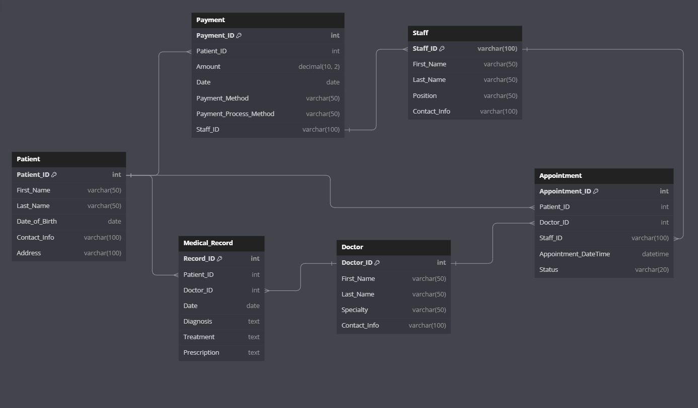

# Car Hire Management System by Waheed Khaled.

Command to run application

```bash
flask --app main run --debugger
```

# Car Hire Database Schema

This repository contains SQL statements to set up a simple car hire database.

## Database Entity Relationship Diagram

Here's an entity-relationship diagram (ERD) illustrating the structure of the car hire database:



## Schema

The SQL script sets up three tables: `Customers`, `Vehicles`, and `Bookings`.

### Customers Table

```sql
CREATE TABLE Customers (
  customer_id INT AUTO_INCREMENT PRIMARY KEY,
  name VARCHAR(255) NOT NULL,
  email VARCHAR(255) UNIQUE NOT NULL,
  created_at TIMESTAMP DEFAULT CURRENT_TIMESTAMP
);

CREATE TABLE Vehicles (
  vehicle_id INT AUTO_INCREMENT PRIMARY KEY,
  car_type ENUM('Small Car', 'Family Car', 'Van') NOT NULL
);

CREATE TABLE Bookings (
  booking_id INT AUTO_INCREMENT PRIMARY KEY,
  customer_id INT NOT NULL,
  vehicle_id INT NOT NULL,
  hire_date DATE NOT NULL,
  return_date DATE NOT NULL,
  FOREIGN KEY (customer_id) REFERENCES Customers(customer_id),
  FOREIGN KEY (vehicle_id) REFERENCES Vehicles(vehicle_id)
);
```
